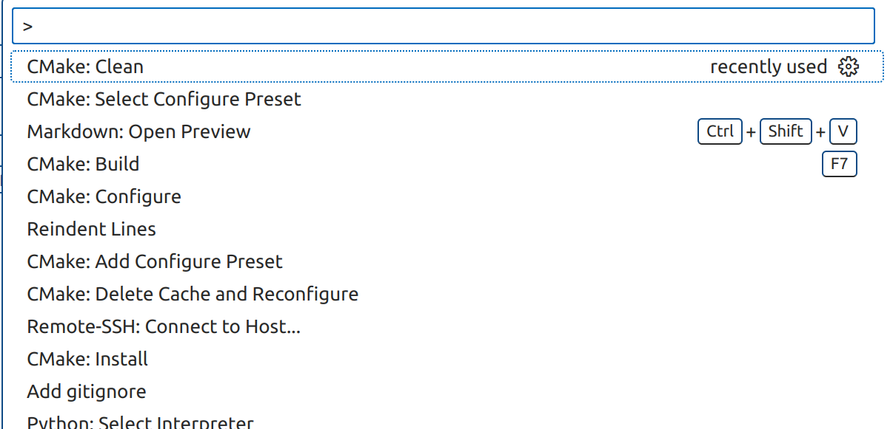

# Use FFTW in a Fortran Project

## Create module `m_fftw3`
Just create a file `m_fftw3.f90`, and the contents are
```fortran
module m_fftw3
    use, intrinsic :: iso_c_binding
    implicit none
    include 'fftw3.f03'
end module m_fftw3
```
For linting purpose, I copy all contents of `fftw3.f03` to `m_fftw3.f90` and
configure the `settings.json` as
```JSON
{
    "fortran.linter.modOutput": "${workspaceFolder}/.modules"
}
```

## Build system
In a new project, you should organize you `cmake` folder as
```console
cmake
├── FindFFTW.cmake
├── gcc-toolchain.cmake
└── intel-toolchain.cmake
```
The `FindFFTW.cmake` is copied from [here](https://github.com/egpbos/findFFTW).
The other two modules are toolchains which configure fortran compilers used in
a CMake preset. To use those toolchains, we need to load proper modules before open vscode
```bash
# GNU
module load fftw/3.3.10-gcc-11.4.0
# Intel
module load intel/oneapi2025.0 fftw/3.3.10-oneapi2025.0
```
such that the library path and 'FFTW_ROOT' for `FindFFTW.cmake` will be set.

For the build process in vscode, I use the intel toolchain with debug symbols
for an example. First `Ctrl + Shift + P` to select configure preset.


## Lessons
### in-place plan
While I wrote the FFT accelerated Poisson solver, I plan the in-place real to
real FFT as this
```fortran
    ...
    real(rp) :: in(nx, ny), out(nx, ny)
    ...
    plan = fftw_plan_guru_r2r(rank, dims, howmany_rank, howmany_dims, in, out, [itype], FFTW_ESTIMATE)
```
This works fine up to a $128^2$ array. However, my Poisson solver fails at $256^2$.
After intensive debug, I find the problem is in the FFT since the backward transform
cannot recover the original data after scaling. Therefore, now, I plan as
```fortran
    ...
    real(rp) :: in(nx, ny)
    ...
    plan = fftw_plan_guru_r2r(rank, dims, howmany_rank, howmany_dims, in, in, [itype], FFTW_ESTIMATE)
```
It works until $8192^2$. I don't know the reason. However, I learn a lesson as
**Plan in-place transform with same array**.